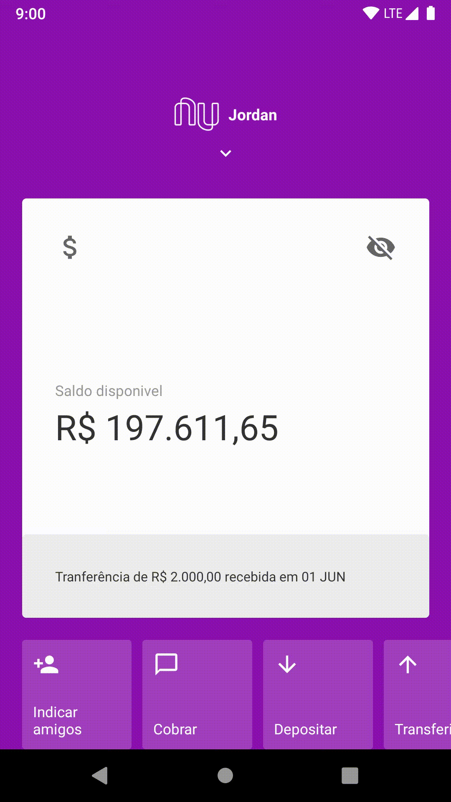

# NuBank Clone

Project in React Native that is a interface replika of NuBank

# Installation

Clone repository

> git clone https://github.com/Trosdan/GoEcommerce.git

Download dependencies with yarn

> yarn

Run the project

> react-native run-android

or

> react-native run-ios
